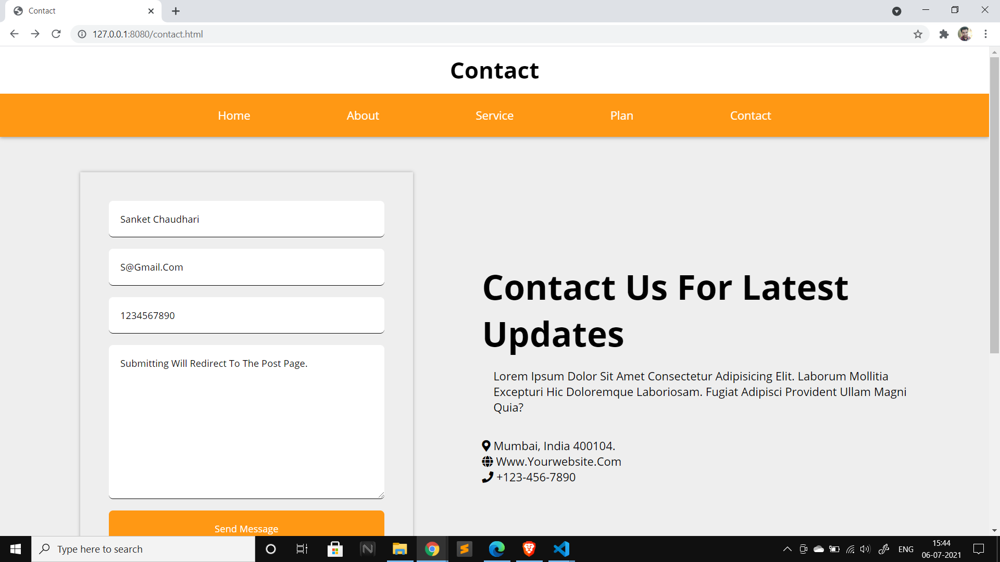

## Express.js App

An app built using Express.js that serves static pages and also has a post routing.

## Motivationcld

My first Express / node.js project.

## Tech/framework used

**Built with**

- [Express](https://expressjs.com/)
- [Nodejs](https://nodejs.org/en/)
- [Pug](https://pugjs.org/api/getting-started.html)

## Getting Started

### Prerequisites

Make sure you have node.js installed and have npm. If not Download node.js from [here](https://nodejs.org/en/download/).

To get latest npm version use:

```sh
npm install npm@latest -g
```

## How to use?

1. Clone the repo
   ```sh
   git clone https://github.com/sanketchaudhari10/Express-App.git
   ```
2. Install NPM packages
   ```sh
   npm install
   ```
3. To run the server, make sure you are in the root directory then
   ```
   node app.js  **or**
   npm run start
   ```

## Screenshots





